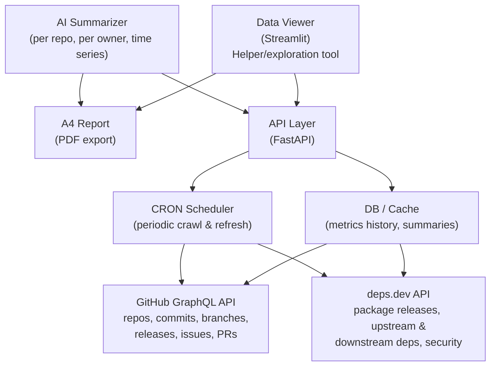

# Epic: Automated Maturity Assessment Platform

**Status:** In Progress (multi-branch development)
**Owner:** DPG Alliance
**Branches:** `main`, `oc` (API + DB), `summarizers` (AI layer)

---

## Vision

Build a comprehensive, automated maturity assessment platform that goes beyond raw metrics. The platform crawls GitHub organizations and their repositories, enriches data from external sources (deps.dev), and uses AI to produce **qualitative, human-readable reports** about the health and maturity of open-source projects -- per repository and per organization.

The end goal is an **A4-sized maturity report** suitable for stakeholders, funders, and project leads -- not a dashboard of numbers, but a narrative analysis backed by data.

---

## Context & Current State

The Maturity Tool already provides a working Streamlit-based viewer (`main` branch) that fetches GitHub data via the GraphQL API and computes metrics across five categories: contributions, code health, releases, community engagement, and branch activity. Development on the `oc` branch adds a FastAPI backend and SQLite database. The `summarizers` branch layers AI-powered narrative generation on top.

This epic formalizes the roadmap to bring these threads together into a production-ready platform.

---

## Architecture Overview

---

## Components

### 1. Metrics & Data Collection

**What exists:** GitHub GraphQL integration fetching commits, branches, releases, issues, and PRs for any owner/repo combination. Metrics computed include bus factor, HHI diversity index, code churn, staleness, release frequency, community response times, and more. A list of distinguished owners (egovernments, mosip, mojaloop, etc.) is pre-configured.

**What's needed:**

- **Owner-level crawling:** Automatically discover and crawl **all repositories** under a GitHub organization, not just individually selected ones. The robot crawls an owner and processes every repo.
- **deps.dev integration:** A new data collector that queries the [deps.dev API](https://deps.dev/) to enrich metrics with:
  - **Package releases** -- npm, PyPI, Maven, etc. releases that are not visible on GitHub (e.g., npm publish events, version metadata)
  - **Upstream dependencies** -- what the project depends on
  - **Downstream dependencies** -- who depends on this project (adoption signal)
  - **Security screening results** -- known vulnerabilities, advisory data
  - **Activity signals** -- maintenance status from the package ecosystem perspective
- **Iterative querying:** deps.dev requires walking dependency trees. The deps.dev agent handles pagination and recursive lookups, feeding structured results into the summarizer.

### 2. API Layer (FastAPI)

**What exists (`oc` branch):** A FastAPI application with route modules for metrics, repositories, and summaries. Prototype stage.

**What's needed:**

- Formalize the REST API as the **single source of truth** between data collection, storage, and consumers (viewer, summarizer, report generator).
- Endpoints for:
  - Triggering crawls (per owner, per repo)
  - Querying stored metrics (current and historical)
  - Retrieving and triggering AI summaries
  - Exporting report data
- Authentication and rate limiting for production use.
- Decision: is the API layer a hard requirement, or can the summarizer and viewer work directly against the DB? **Recommendation:** yes, the API layer is needed -- it decouples the crawl/storage backend from multiple consumers and enables future integrations (webhooks, external dashboards, CI/CD plugins).

### 3. Database & Cache

**What exists (`oc` branch):** SQLite prototype with SQLAlchemy models and Alembic migrations. Basic cache storage and metrics tracking.

**What's needed:**

- **Schema design** covering:
  - **Owners** -- GitHub organizations being tracked
  - **Repositories** -- repos per owner, metadata
  - **Metric snapshots** -- time-series storage of all computed metrics per repo, per crawl run (enables trend analysis and retrospective reporting)
  - **Cache layer** -- raw API responses cached with TTL to avoid rate limits and speed up re-analysis
  - **Summaries** -- AI-generated narratives, versioned, per repo and per owner, with drift metadata
  - **deps.dev data** -- package metadata, dependency graphs, security advisories
  - **Crawl runs** -- audit log of when each owner/repo was last crawled, status, errors
- Decision on DB engine for production: SQLite (simple, file-based) vs PostgreSQL (scalable, hosted). **Recommendation:** PostgreSQL for production (needed for concurrent crawls and hosted deployment), SQLite for local development.
- CRON task scheduling: periodic crawl jobs that refresh metrics on a configurable schedule (e.g., daily for active orgs, weekly for others). Decision needed on scheduling approach -- system cron, Celery, APScheduler, or cloud-native (e.g., Cloud Scheduler + Cloud Run).

### 4. AI Summarizer

**What exists (`summarizers` branch):** Prototype using OpenAI GPT-4o-mini with prompt templates for org-level and repo-level summaries. Drift detection with configurable thresholds. Summary versioning and history tracking (last 5 summaries, 30-day max age).

**What's needed:**

- The summarizer reads **all metrics** for a given owner or repo and writes a **qualitative narrative** -- not "bus factor is 2" but "this project has a high concentration risk; two contributors account for the majority of commits, and no new contributors have joined in 6 months."
- **Per-owner summaries** -- aggregate analysis across all repos in an organization, identifying systemic patterns (e.g., "3 of 12 repos have had no releases in over a year").
- **Per-repo summaries** -- detailed analysis of a single repository's health trajectory.
- **Retrospective / time-series mode** -- the summarizer should be able to analyze metric trends over time, not just current snapshots. "Commit activity declined 40% quarter-over-quarter" is more useful than "12 commits last month."
- **Drift detection** -- already prototyped. Flag when metrics have shifted significantly since the last summary, triggering a re-summarization.
- Prompt engineering for consistent, structured output suitable for embedding in the A4 report.

### 5. deps.dev Agent

A dedicated AI-powered agent that:

- Accepts a GitHub repository as input
- Maps it to the corresponding package(s) on deps.dev (a repo may publish multiple packages)
- Iteratively queries the deps.dev API to collect:
  - Full release history with timestamps and version metadata
  - Dependency tree (upstream) with version constraints
  - Reverse dependencies (downstream) -- who uses this package
  - Security advisories and vulnerability data
  - Maintenance/activity signals from the package registry
- Structures the collected data and feeds it to the summarizer as additional context
- Handles the iterative nature of deps.dev queries (pagination, tree walking, rate limits)

### 6. Data Viewer (Streamlit)

**What exists (`main` branch):** Fully functional Streamlit app with owner selection, repo selection, time range filtering, and metric visualization across all categories. Deployed to Streamlit Cloud.

**Role going forward:** The viewer is a **helper and exploration tool** for developers and analysts -- not the primary deliverable. It provides interactive access to raw metrics and visualizations for debugging, exploration, and ad-hoc analysis. The primary stakeholder-facing output is the A4 report.

### 7. A4 Report Generator

**New component.** Generates a formatted, printable (A4-sized) PDF report combining:

- AI-generated narrative summaries (per owner and per repo)
- Key metric visualizations (charts, trend lines)
- deps.dev insights (dependency health, release cadence from package registries)
- Risk flags and recommendations
- Historical comparison (how metrics have changed over time)

This is the **primary deliverable for stakeholders** -- a document that can be shared with funders, board members, and project leads who need a comprehensive understanding of project maturity without using the interactive tool.

---

## User Stories

### Near-term

- [ ] **DPG Data Viewer (self-deployed)** -- Deploy the Streamlit viewer as a self-hosted instance (beyond Streamlit Cloud) with persistent configuration and authentication.
- [ ] **Release and hosting** -- Production deployment of the full platform, including API server, database hosting, and viewer. Define infrastructure (cloud provider, CI/CD pipeline, monitoring).
- [ ] **Data structure design and documentation** -- Formalize the database schema for metrics, cache, summaries, and deps.dev data. Document the data model. Design and implement CRON task scheduling with a decision on scheduling technology.
- [ ] **AI Summarizer** -- Production-ready summarizer that checks metrics and writes narrative reports. Supports per-owner summaries, per-repo summaries, and retrospective time-series analysis. Prompt tuning for consistent, stakeholder-appropriate output.
- [ ] **deps.dev Agent** -- Build the iterative deps.dev query agent that collects package release data, dependency graphs, and security screening results, feeding structured output to the summarizer.

### Later

- [ ] **Test coverage integration** -- Integrate test coverage metrics using built-in CI/CD tools (e.g., Codecov, Coveralls) that feed results into the platform's API. This extends the maturity model with code quality signals beyond what GitHub provides natively.
- [ ] **A4 report generation** -- PDF export combining AI narratives, visualizations, and recommendations into a stakeholder-ready document.

---

## Open Decisions

| Decision | Options | Notes |
|----------|---------|-------|
| API layer: required? | Yes (recommended) / No (direct DB access) | API decouples consumers from storage, enables future integrations |
| Database engine | SQLite (dev) / PostgreSQL (prod) | PostgreSQL recommended for concurrent access and hosted deployment |
| CRON scheduling | System cron / Celery / APScheduler / Cloud-native | Depends on hosting decision |
| AI model | OpenAI GPT-4o-mini (current) / GPT-4o / Claude / self-hosted | Cost vs quality tradeoff; current prototype uses GPT-4o-mini |
| Report format | PDF / HTML / both | A4 PDF is the stated goal; HTML could be an intermediate step |
| deps.dev mapping | Automatic (heuristic) / Manual (configured per repo) | Some repos publish multiple packages; mapping may need curation |

---

## Risks & Dependencies

- **GitHub API rate limits** -- Crawling all repos under large organizations will hit rate limits. Caching and incremental crawls are essential.
- **deps.dev coverage** -- Not all GitHub projects publish to package registries. The deps.dev agent needs graceful handling of unmapped repos.
- **AI cost at scale** -- Summarizing hundreds of repos with GPT-4 class models has cost implications. Drift detection (only re-summarize when metrics change significantly) helps control this.
- **Data freshness vs cost** -- More frequent crawls mean fresher data but higher API and compute costs. The CRON scheduling decision should balance these.

---

## Success Criteria

1. A stakeholder can receive an A4 report for any tracked organization that provides a **narrative understanding** of project maturity -- not just numbers.
2. The platform automatically crawls all repos under configured owners on a scheduled basis.
3. Metrics are enriched with deps.dev data (releases, dependencies, security) where available.
4. Historical trends are tracked and surfaced in summaries ("improving", "declining", "stable").
5. The system requires minimal manual intervention after initial configuration.